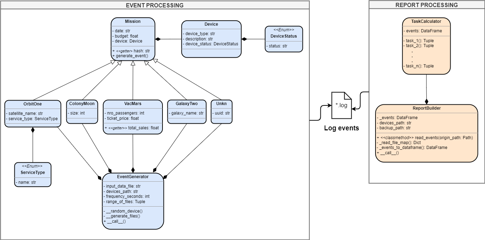
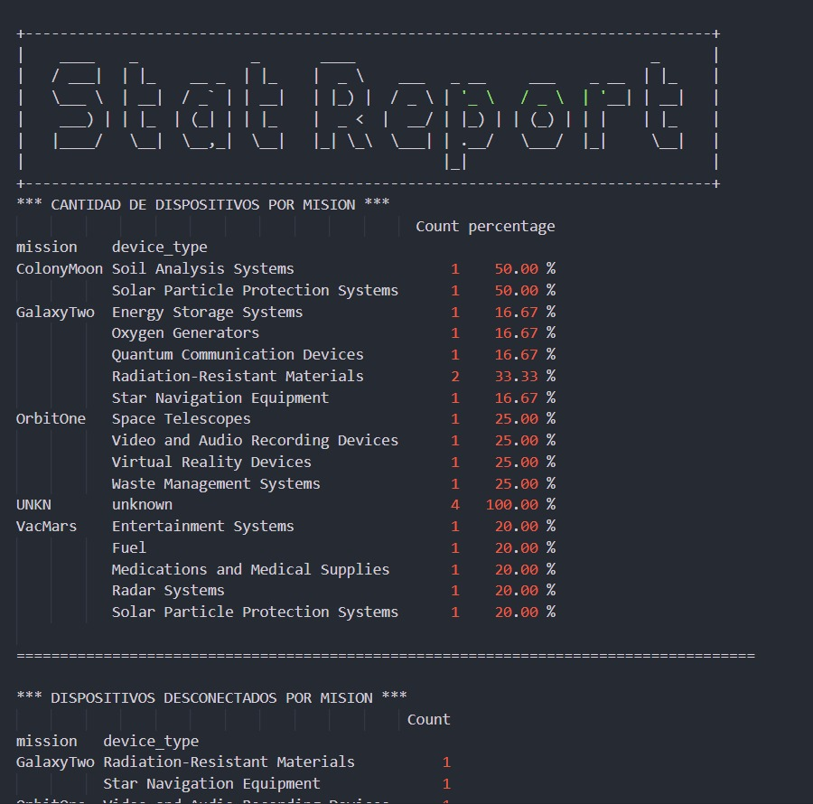

# Apollo 11 Simulator
<p align="center"><i>Image credits: <a href="https://www.freepik.es/foto-gratis/diseno-collage-viajes-espaciales_94964717.htm#page=2&query=misiones%20espaciales&position=6&from_view=search&track=ais&uuid=b9537576-012c-4a51-9b65-cd29d7156015">Freepik</a></i></p>

## Table of contents
<!--ts-->

- [Apollo 11 Simulator](#apollo-11-simulator)
  - [Table of contents](#table-of-contents)
  - [Problem statement](#problem-statement)
  - [Directory layout](#directory-layout)
  - [Architecture](#architecture)
    - [Generator:](#generator)
    - [Reporter:](#reporter)
  - [Setup](#setup)
  - [Running the app](#running-the-app)
    - [Generator](#generator-1)
    - [Reporter](#reporter-1)
  - [Configuration](#configuration)
  - [Test](#test)
  - [Acknowledgments](#acknowledgments)
  - [About the authors](#about-the-authors)
    - [Erick Calderin:](#erick-calderin)
    - [Ana Arteaga Jimenez](#ana-arteaga-jimenez)
    - [Pablo Alarcón](#pablo-alarcón)
<!--te-->

## Problem statement
El propósito central de este proyecto es evaluar nuestras destrezas y competencias en Python, focalizándonos lo aprendido en los niveles 3 y 4 del Bootcamp.

Como estudiantes, nos enfrentamos al desafío emocionante de colaborar en cuatro proyectos visionarios de la NASA: OrbitOne, ColonyMoon, VacMars y GalaxyTwo. Conscientes de la importancia de evitar errores, estamos contribuyendo al desarrollo de un sistema de monitoreo que opera cada 20 segundos, permitiéndonos tener un control minucioso de los dispositivos empleados en cada misión.

Hemos sido convocados como ingenieros en jefe, y se nos ha asignado la tarea de crear el programa "APOLLO11-SIMULATOR". Este programa, operado manualmente por el comandante, desempeñará un papel crucial en el éxito de estas trascendentales iniciativas científicas y exploratorias. Nos sentimos honrados de ser parte de este proyecto significativo que contribuirá al avance de la exploración espacial y a la seguridad de los astronautas y turistas involucrados.

## Directory layout
```
.
├── apollo11_simulator          #Code
│   ├── common
│   ├── config                  # Configuration files
│   ├── exceptions              # Exceptions
│   └── models                  # Classes
│       ├── event_processing    # Generator classes
│       └── report_processing   # Reporter classes
├── images                      # Assets
├── input_data                  # Simulation data
└── tests                       # Tests
    └── test_data

11 directories

```


## Architecture
Hemos creado un diagrama de clases que sirve como esqueleto para nuestro proyecto, debajo se muestra la version final del mismo puesto que estuvo en constante evolución desde las primeras etapas de análisis y desarrollo. Se puede distinguir a simpla vista que nuestro enfoque estuvo basado en los pilares de la  POO (Programación Orientada a Objetos):



El programa "APOLLO11-SIMULATOR" consta de dos componentes principales:

### Generator:
* Responsable de la simulación de datos entre componentes.
* Genera registros en archivos siguiendo especificaciones dadas.
* Utiliza la periodicidad de ejecución establecida.

### Reporter:
* Encargado de la generación de reportes y manejo de archivos.
* Analiza eventos, gestiona desconexiones, consolida misiones, calcula porcentajes y genera informes en un archivo plano.
* Proporciona informes estadísticos para la toma de decisiones.

## Setup
1. Instalar y configurar poetry de acuerdo a tu Sistema Operativo: https://python-poetry.org/docs/
2. Ejecutar `poetry shell` para activar el ambiente.
3. Correr `poetry install` para instalar dependencias

## Running the app
Se pueden ejecutar ambas partes, de manera independiente, de la siguiente forma:

### Generator
Ejecute el siguiente comando para iniciar la simulación de datos:

`python -m apollo11_simulator generate-events`

### Reporter
Ejecute el siguiente comando para generar reportes y realizar el manejo de eventos:

`python -m apollo11_simulator generate-report`

## Configuration

``` 
  frequency_seconds: 2    <---- Frecuencia en la que se generarán eventos
  input_data_file: input_data/simulation.json    <---- Archivo que contiene datos de simulación
  devices_path: devices    <---- Directorio que almacenará los archivos
  backup_path: backup    <---- Directorio que contendrá los archivos luego de ser procesados
  range_of_files:
    min: 2    <---- Cantidad mínima de archivos a generar
    max: 5    <---- Cantidad máxima de archivos a generar

``` 

## Test
Podrás ejecutar los tests de la aplicación mediante:

`pytest tests/`

<p align="center">

## Acknowledgments
Agradecimientos a todas aquellas personas que hicieron posible este espacio de aprendizaje, especialmente al equipo de Ruta N; a nuestro tutor Luis Vásquez y nuestro mentor Daniel Restrepo, quienes con paciencia y siempre dispuestos nos acompañaron y brindaron las bases para desarrollar el conocimiento y materializarlo en este proyecto que presentamos.


## About the authors

### Erick Calderin:
Ingeniero de Sistemas, estudiante de maestría, con experiencia en desarrollo, apasionado a Python e Inteligencia Artificial.  
LinkedIn:  
https://www.linkedin.com/in/erick-calderin-5bb6963b/ 

### Ana Arteaga Jimenez
Administradora financiera, estudiante de inglés, experiencia en diferentes áreas administrativas, y coordinación de operaciones. Explorando el mundo de la programación.

### Pablo Alarcón
Publicista, Emprendedor y estudiante de Certified Tech Developer, con determinación para ser parte de la industria tecnologica como desarrollador BackEnd.  
LinkedIn: 
https://www.linkedin.com/in/pablo-alarcon-dev


